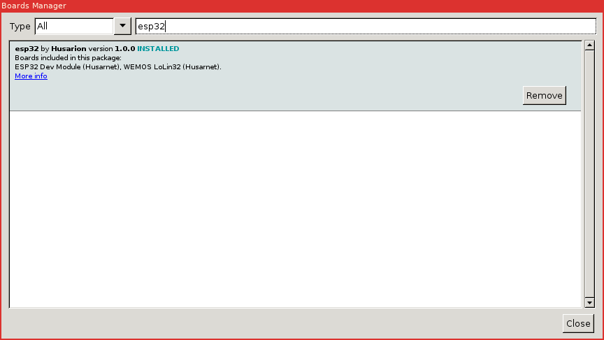

# Arduino core for ESP32 WiFi chip

### Need help or have a question? Ask on https://community.husarnet.com/

## Contents
- [Development Status](#development-status)
- [Installation Instructions](#installation-instructions)
- [Decoding Exceptions](#decoding-exceptions)
- [Issue/Bug report template](#issuebug-report-template)
- [ESP32Dev Board PINMAP](#esp32dev-board-pinmap)

## Installation Instructions

1. Install and launch latest [Arduino IDE](https://www.arduino.cc)

2. Click on File > Preferences.

3. Enter "https://files.husarion.com/arduino/package_esp32_index.json" in "Additional Board Manager URLs":

   

4. Launch Board Manager (Tools > Board > Board Manager).

   

5. Install "esp32" by Husarnet.

6. Select your board in Tools > Board > ESP32 Arduino (Husarnet).

7. Start coding!

#### Decoding exceptions

You can use [EspExceptionDecoder](https://github.com/me-no-dev/EspExceptionDecoder) to get meaningful call trace.

#### Issue/Bug report template
Before reporting an issue, make sure you've searched for similar one that was already created. Also make sure to go through all the issues labelled as [for reference](https://github.com/espressif/arduino-esp32/issues?utf8=%E2%9C%93&q=is%3Aissue%20label%3A%22for%20reference%22%20).

Finally, if you're sure no one else had the issue, follow the [ISSUE_TEMPLATE](docs/ISSUE_TEMPLATE.md) while reporting any issue.

## ESP32Dev Board PINMAP

## Hint

Sometimes to program ESP32 via serial you must keep GPIO0 LOW during the programming process
